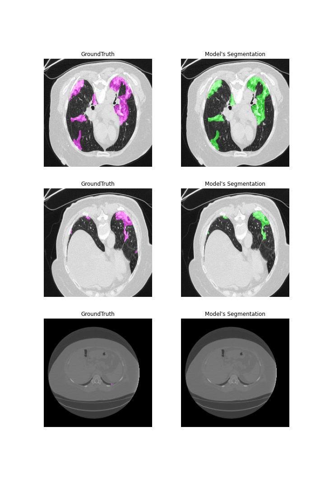

# Segmentation_lesion_pulmonaire

L'objectif de ce projet est de développer une IA capable de réaliser de la segmentation sur des images radio pulmonaire, afin d'y détecter des lésions.

## DataSet

Nous disposon d'un jeu de données composé d'image radio de poumon, et les labellisation associé. Les labellisations ont été réaliser par un expert, et se présente sous la forme d'un masque.

## Transfert Learning (modèle UNET)

Le modèle choisit pour faire la segmentation est le modèle UNET. Afin de gagner du temps sur l'entrainement du model nous avons décidé de faire du *Transfert Learning* à partir des poids du model entrainé sur le DataSet **ImageNet**.

## Résultat de segmentation

- average F1-Score : 0.79
- average IoU : 0.68
- average Recall : 0.75
- average Recall : 0.87

